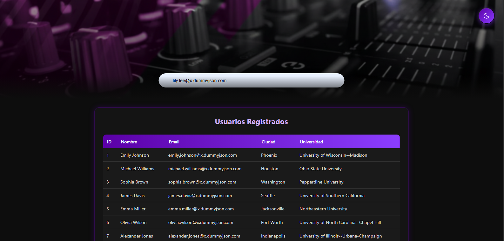

# Proyecto – Prueba Técnica Programador  
Agendamientos Estudiantiles + Consumo de API Externa + MVC

Este repositorio contiene la solución completa a la prueba técnica solicitada. Incluye lógica en PHP, API REST, consultas SQL, consumo de API externa y un módulo MVC con interfaz moderna (modo claro y oscuro).

---

## 🧩 Estructura del Proyecto

/src  
├── api.php                # Consumo API externa (DummyJSON) y guardado en BD  
├── api_agendamientos.php  # API propia de agendamientos  
├── logica.php             # Lógica de filtrado y agrupamiento por sede  
├── modelo.php             # Modelo MVC  
├── controlador.php        # Controlador MVC  
├── conexion.php           # Conexión a base de datos  
└── assets/                # Recursos gráficos y estilos

En la raíz:  
- `index.php` → Vista principal con filtro de usuarios  
- `consultas.sql` → Consultas MySQL pedidas en la prueba  
- `git_respuestas.txt` → Comandos Git solicitados  
- `analisis_tecnico.md` → Diagnóstico de lentitud
- README.md

> Nota: La carpeta `src/test/` contiene scripts de prueba (Postman / scripts PHP) que **no se suben al PR**.

---

## 🎨 Vista del Frontend



---

## 🗂️ Tabla `usuarios_dummy`

- Contiene los usuarios importados desde la API externa `https://dummyjson.com/users`.  
- Campos principales: `id`, `nombre`, `email`, `ciudad`, `universidad`.  
- Usada para mostrar los datos en el front con filtrado por nombre, email o universidad.  
- Ordenada por `id DESC` para ver los registros más recientes primero.

---

## 🧪 Scripts de prueba

- `src/test/crear_agendamiento.php` → Inserta agendamientos de prueba  
- `src/test/generar_token.php` → Genera token de prueba  
- `src/test/listar_agendamientos.php` → Lista agendamientos en JSON  

> Solo para pruebas locales, no forman parte del flujo de producción.

---

## 🚀 Requisitos

- PHP 8.x  
- MySQL o MariaDB  
- Servidor local (XAMPP, WAMP o similar)  
- Extensión mysqli habilitada  

> Versión utilizada para el desarrollo: **PHP 8.2**

---

## ⚙️ Cómo ejecutar el proyecto

1. Clonar el repositorio  
2. Importar o crear la base de datos y ejecutar `consultas.sql`  
3. Configurar las credenciales en `conexion.php`  
4. Colocar el proyecto en la carpeta `htdocs` (o equivalente)  
5. Abrir en navegador: http://localhost/dna_api/index.php
6. Para importar usuarios desde la API externa:  


7. Para consumir la API propia de agendamientos:  

- GET → `/src/api_agendamientos.php`  
- POST → `/src/api_agendamientos.php` (usando token generado previamente)

---

## 📌 Decisiones Técnicas

- MVC para separar responsabilidades  
- Consumo de API externa usando `file_get_contents`  
- Front con filtros dinámicos y ordenamiento por `id DESC`  
- Dashboard claro/oscuro, UI moderna  
- API de agendamientos con validación por token y respuestas JSON estandarizadas  

---

## 🗃️ Comandos Git utilizados

Para subir los cambios completos a GitHub se ejecutaron los siguientes pasos:

```bash
# Inicializar un repositorio Git en la carpeta local
git init

# Agregar todos los archivos del proyecto (excepto los de prueba en src/test/)
git add src/logica.php src/api_agendamientos.php src/modelo.php src/controlador.php src/api.php src/conexion.php src/assets index.php consultas.sql git_respuestas.txt analisis_tecnico.md README.md

# Confirmar los cambios con un mensaje de commit
git commit -m "Entrega prueba técnica completa: MVC, API, frontend y documentación"

# Cambiar el nombre de la rama principal a 'main'
git branch -M main

# Conectar el repositorio local con el remoto en GitHub
git remote add origin https://github.com/BrikmanP/dna_api-agendamientos.git

# Subir los cambios al repositorio remoto
git push -u origin main

